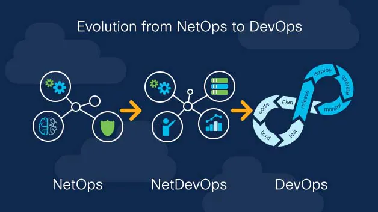

# NetOps-Roadmap

 

## Introduction
NetOps is an approach to network operations that prioritizes agility and rapid deployments. The approach incorporates techniques such as automation, virtualization, and orchestration.

### Why is a NetOps approach needed?
Today's digital enterprise must be more agile than ever to keep pace with customer expectations. Continuous network automation and validation are designed to simplify network operations to increase speed and efficiency, improve availability, and foster agility and innovation.

However, network troubleshooting still accounts for a significant amount of NetOps engineering time, and needs to be optimized with agile platform strategies.

To support this goal, DevOps has incorporated tools such as automation and orchestration to dramatically reduce response times and development cycles.

Historically, networks have been an obstacle to agile development, managed manually and in a reactive, unplanned way, with an emphasis on availability rather than performance.

With the rise of complex digital enterprises and the need for greater agility and faster content delivery, the network—and network management—must play a bigger role in the development process. NetOps teams need an integrated view of health and performance, as well as insights so they can take action faster.

NetOps brings DevOps concepts like automation, orchestration, and virtualization into network operations, allowing it to be part of the development process. A consistent view across infrastructure and applications data allows NetOps and DevOps teams to share a common view of the data.

### How is NetOps deployed in enterprises?
In some cases, NetOps can be adopted through technology. For example, tools originally designed to help automate workflows, such as Ansible, Puppet, and Chef, have been upgraded to include network operations in their process. These tools allow DevOps teams to make configuration changes and update devices automatically.

However, NetOps is not simply deployed through technology. It's a mindset that may require cultural shifts to be fully embraced.

In the past, the missions of development and network teams often clashed, with developers prioritizing robust applications and rapid deployments, while network teams prioritized availability, reliability, and capacity.

### How does NetOps relate to DevOps and SecOps?
NetOps, DevOps, and SecOps are all relatively new methodologies in three areas—networking, development, and security—involved in successful agile deployments. Ideally, NetOps, DevOps, and SecOps are interdependent and form parts of a collaborative process.

⭕️ **I highly recommend you to study this article about [NetOps’ Evolution Into the Cloud](https://blogs.cisco.com/datacenter/netops-evolution-into-the-cloud).**

## Fundamental Step
- Network Concepts
    - [Network+ CBTnuggets](https://www.cbtnuggets.com/it-training/comptia/network-plus) (English Language)
    - [Network+](https://faradars.org/courses/fvnet9410-network-plus) (Persian Language)
## Step 0: Basic requirements
- Linux (LPIC-1)
    - [LPIC-1 with Jadi](https://maktabkhooneh.org/course/%D8%A2%D9%85%D9%88%D8%B2%D8%B4-%D8%B1%D8%A7%DB%8C%DA%AF%D8%A7%D9%86-%D8%A2%D8%B2%D9%85%D9%88%D9%86-LPIC1-mk711/) (Persian Language)
    - [LPIC-1 CBTnuggets](https://www.cbtnuggets.com/it-training/linux/lpic-1-linux-administrator) (English Language)
- Bash-Script
    - [Bash Script Tutorial](https://github.com/ahmadalibagheri/bash-script-tutorial) (Sample Traning Code)
- Git
    - [Git Learning with Jadi](https://faradars.org/courses/fvgit9609-git-github-gitlab) (Persian Language) 
    - [Git Learning with Mosh](https://codewithmosh.com/p/the-ultimate-git-course) (English Language) 
    - 
 💡 *By the end of this chapter, we will be capable of write some bash scripts and use Linux to automate some tasks and also we will be able to collaborate on github using Git.*
 
## Step 1: IaC (Infrastructure as Code)
- Hashicorp Terraform 
    - [Terraform Tutorial](https://github.com/ahmadalibagheri/terraform-tutorial) (Sample Traning Code from non public cloud provider)
  
  💡 *We can provision our infrastructure with Terraform, consider this to be your End-to-End Solution.*

## Step 2: Configuration Managment
- Ansible
    - [Ansible Tutorial](https://github.com/ahmadalibagheri/ansible-tutorial) (Sample Traning Code)

💡 *A great and lovely tool to automate your daily tasks, Ansible is the most common automation tools for Network engineers.*

## Step 3: Continuous Integration/Continuous Deployment
- Jenkins
    - [Jenkins Tutorial](https://github.com/ahmadalibagheri/jenkins-tutorial) (Sample Traning Code)
 
 💡 *The power of automating all your tasks from 0 to 100 gathers here!*
 
## Step 3.1: Python (optional)
💡 This step is optional, but it is highly recommended. you should know at least one high-level programming language like python. at this point should be also familiar with ansible to make your aytomation tasks even easier.
  - [Python Tutorial](https://www.cbtnuggets.com/it-training/python/network-engineers-intro) (English Language)

## Step 4: Monitoring
- Zabbix 
   - [Zabbix Tutorial](https://www.zabbix.com/manuals) (Strongly Recommended)
- Solarwinds
   - [Solarwinds Tutorial](https://documentation.solarwinds.com/) (Optional)
 
 💡 *Monitoring your network is a critical point for your infrastructure. you should be familiar with at least one network monitoring tool like zabbix.*
 
 ## Step 5: Containerization
 - Docker
   - [Docker Tutorial](https://www.tutorialspoint.com/docker_masterclass_docker_and_swarm/index.asp) (English Language)
 
💡 *As NetOps engineers we should know a containerization solution like docker, we need this to deploy our applications in micro service format. this will bring us better performance and easier management too.*
